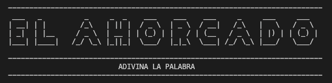

# Juego del ahorcado o hangman

_Juego del ahorcado o hangman, hecho en python.

## Inicio 🚀

* ** 2 _Descargar el archivo zip o clonar el repositorio.
* ** 2 _Debes de tener python instalado en tu ordenador.

## Imagen 🎥

* **  _Asi se ve el juego: 

## Construido con 🛠️

* [Python 3](https://www.python.org/downloads/) - Lenguaje de programación.
* [Consola o Terminal]() - Para ejecutar el codigo necesitas la terminal de tu ordenador.
* [Tutorial](https://www.codigopiton.com/como-hacer-el-juego-del-ahorcado-en-python/) - lectura.

---
⌨️ con ❤️ por [Juan Teixeira]  😊
* [Instagram](https://www.instagram.com/jteixcode/)
* [FaceBook](https://www.facebook.com/JTeixCode)